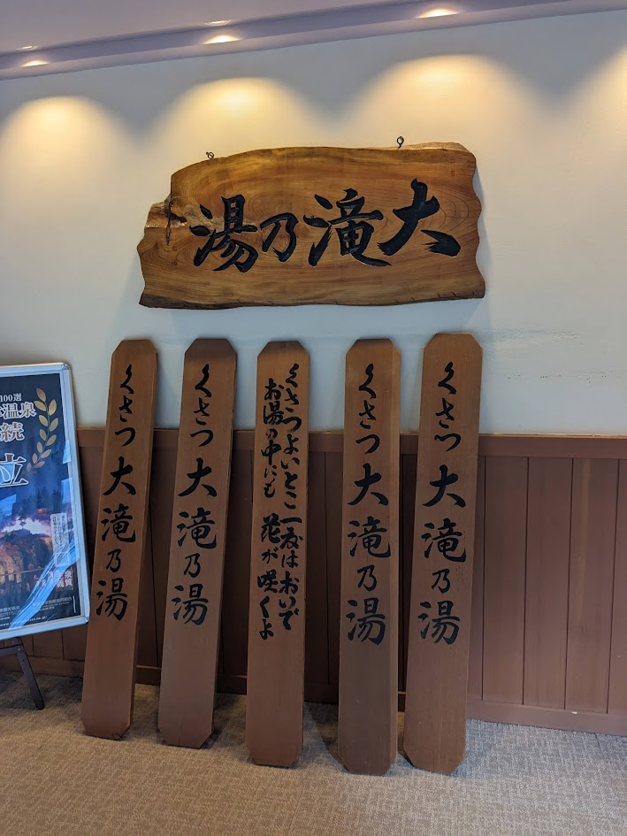
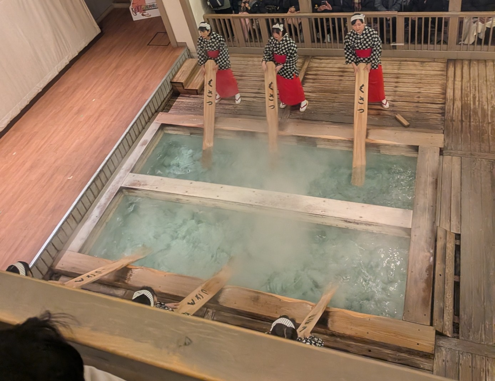
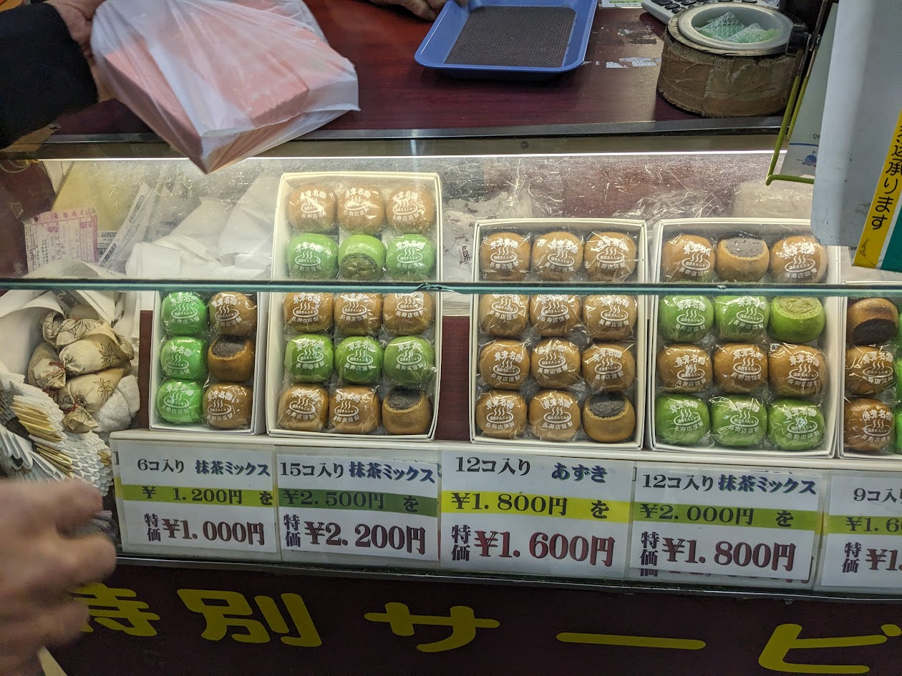

## いきさつ
草津温泉というのは、日本有数の温泉地であり、その名湯ぶりは古くから知られている。  
そして、基本的に１泊２日かそれ以上で訪れることが多いのだが、今回は日帰りで訪れてみた。そして、日帰りでも十分に楽しめるのか、検証する。

## アクセス
草津温泉へのアクセスは、バスか鉄道が一般的である。  
東京方面からは、JR吾妻線の長野原草津口駅まで特急列車で行き、そこからバスで草津温泉に向かうルートが便利である。  
上野駅から長野原草津口駅までは、特急「草津・四万号」で約2時間30分である。  
バスは、長野原草津口駅から草津温泉バスターミナルまで約25分である。  

## 行程
今回は、休日ダイヤの場合を想定して、以下の行程で訪れた。
1. 上野駅発 9:00 - 長野原草津口駅着 11:24 (特急「草津・四万31号」)
2. 長野原草津口駅発 11:31 - 草津温泉バスターミナル着 11:53 (バス)
3. 草津温泉バスターミナル発 17:00 - 長野原草津口駅着 17:25 (バス)
4. 長野原草津口駅発 17:52 - 高崎駅着 19:17 (普通列車)

### 9:00 特急で長野原草津口駅へ
特急「草津・四万号」は、上野駅から長野原草津口駅まで直通で運行されている。  
車両はE257系などで、快適な座席と車内設備が整っている。  
車内では、車窓からの景色を楽しみながら、のんびりと過ごすことができる。  
途中、吾妻渓谷や浅間山などの美しい風景が広がる。また、揉めに揉めた八ッ場ダムも車窓から見ることができる。長野原草津口駅周辺は、八ッ場ダム建設に伴い大きく変わった地域である。水没してしまったため、街や線路は少し離れた場所へ移動した。

ちなみにこの日は臨時列車であったため、国鉄色E653系が充当されていた。
JR東日本公式サイト: https://www.jreast.co.jp/multi/traininformation/kusatsu_shima/

### 11:45 バスで草津温泉へ
長野原草津口駅から草津温泉までは、バスで約30分である。  
バスは、駅前のバスターミナルから特急列車から接続の便があり、便利である。列車の接続以外は便がないため、特に心配する必要はない。ちなみに駅周辺にはほぼなにもない。
バスで山道を登ると、次第に温泉街の雰囲気が漂ってくる。

### 13:00 昼食「みやたや食堂」
草津温泉に到着すると、もうお昼時なので、まずは昼食を取るのがいいだろう。
今回は、中心街を少し離れた場所にある「みやたや食堂」に立ち寄った。

ここは、地元の人にも人気のある食堂で、リーズナブルな価格で本格的な美味しい料理が楽しめる。  
私は「チキンカツ定食」を注文した。チキンカツはボリュームがあり、味も濃厚で満足できた。セットには味噌汁と小鉢も付いており、バランスの良い食事だった。この見た目でわずか900円は非常にお得である。

### 14:00 入浴「大滝乃湯」
昼食後は、草津温泉の名湯を楽しむために、みやたや食堂からすぐ近くの「大滝乃湯」に向かった。
大滝乃湯は、草津温泉の中でも特に人気のある共同浴場であり、広々とした内湯と露天風呂が特徴である。  
入浴料は大人1200円で、タオルのレンタルも可能である。

浴場内は清潔で、温泉の湯は硫黄、、、ではなく正確には硫化水素の香りが漂い、肌もスベスベになる。
露天風呂からは、周囲の自然を眺めながらゆったりと浸かることができ、心身ともにリフレッシュできた。

大滝乃湯公式サイト: https://onsen-kusatsu.com/ohtakinoyu/

### 15:00 湯もみ見学
入浴後は、草津温泉の伝統的な湯もみを見学することにした。
湯もみは、温泉の温度を下げるために行われるもので、草津温泉の名物である。
湯畑の近くにある「熱乃湯」では、定期的に湯もみショーが開催されており、観光客も見学できる。
15:30の回に参加し、迫力ある湯もみの様子を楽しんだ。15:00からチケットの販売が開始される。休日は混んでいて並んでいることが多いので、入浴が終わり次第早めに行くのがオススメだ。ちなみに午後は15:30の回からしかない。

### 西の河原公園を散策
湯もみ見学の後は、西の河原公園を散策した。
この公園は、草津温泉の中心部から徒歩圏内にあり、自然豊かな環境が広がっている。
園内には、温泉が流れる小川や足湯、広場などがあり、のんびりと過ごすことができる。小川はすべて温泉のお湯が流れており、触ると温かい。  
また、公園内には「西の河原露天風呂」もあり、入浴することも可能である。

### 16:30 「長寿店」でお土産購入
西の河原公園への道の途中には、「長寿店」という温泉まんじゅう屋さんがある。
ここは、声掛けがすごいことで有名なお店で、観光客に対して「試食して行きませんかぁ～？お茶もどうぞ～！寒いのでほら、中で食べていってくださいな！」積極的に声をかけてくる。半強制的にまんじゅうとお茶を渡され、店内に誘導される。購入を強制されることはないので、別に買わなくてもよいのだが、せっかくなのでお土産に購入した。  
「特別サービス」「〇〇が1200円のところ1000円」という謎の割引が常に掲示されており、いかにも観光地の土産物屋という感じである。  
ちなみにお味はとても美味しかった。  

### 帰路
楽しい時間はあっという間に過ぎ、17:00のバスで草津温泉を後にした。
長野原草津口駅からは、普通列車で高崎駅まで向かい、そこから新幹線で東京方面へ戻ることができる。
日帰りでも十分に草津温泉を満喫でき、大満足の一日となった。  
ちなみに、17:30発のバスで池袋方面へ直通で帰ることも可能である。  

## まとめ
草津温泉は、日帰りでも楽しめる魅力的な温泉地であることがわかった。
温泉街の雰囲気や名湯、伝統的な文化など、多くの魅力が詰まっている。
次回はぜひ、宿泊してゆっくりと滞在したいと思う。

「草津よいとこ 一度はおいで」という曲があるが、まさにその通りである。なんというか、「クセになる」温泉地である。湧き出るお湯は使っても使っても使い切れないようで、街のあちこちでお湯が流されている。「とりあえず流しておけばよい」、という感じである。まさにお湯のテーマパークとでも言うべき場所であり、みなさんもぜひ一度訪れてみてはいかがだろうか。
