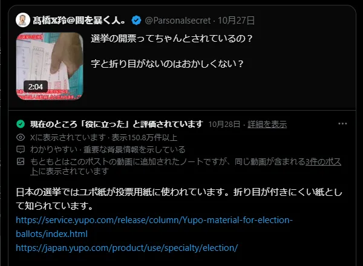

# はじめに

2024/10/15 ～ 2024/10/27にかけて、衆議院議員選挙が行われました。激しい選挙戦の中で、SNSでは選挙に関する偽・誤情報が拡散しました。  
X(Twitter)には「[コミュニティノート](https://communitynotes.x.com/guide/ja/about/introduction)」と呼ばれる、ユーザーが誤解を招く投稿に対して背景情報を追加できる機能があります。  
公開データを分析し、特に影響力が高く、注目されたノートを中心に紹介します。投開票後の選挙に関する誤情報も分析の対象としています。 

# グラフと数字で見る誤情報

グラフと数字で、今回の選挙戦での誤情報を振り返ります。  

10/9 ~ 11/1 の約24日間で、**2348人** のユーザーにより、**7823件** のノートが提案されました。  
このうち、**1584件** は選挙の関連ノートでした。※  

同期間で、**800件以上** のノートが「役に立った」ステータスを獲得し、一般ユーザーにも表示されています。  

「コミュニティノート」プログラムが開始されてからのノート数の推移です。  
ユニークユーザー数がやや増加傾向であり、ノート数もそれに伴い増加しています。    
「選挙関連ノート」は、投開票日である10/27に、開始以来最多の **141ノート** が提案されました。※  

※ 選挙関連ノートの抽出ワード: ["票", "選挙", "政府", "政権", "党", "候補", "議員", "内閣", "首相"]  
（単純なワード抽出なので、これらの数は正確ではありません。） 

自民党総裁選後から現在までのノート数の推移です。
告示日の10/15から、投開票日である10/27に近づくにつれ、選挙関連ノートが増えていることがわかります。  

# 具体的にどんな誤情報があったのか

## 政党・候補者から発信された誤情報

政党・候補者から発信された誤情報もありました。

### 立憲・原口氏のワクチンデマ

ワクチンなどの医薬品を製造・販売するMeiji Seika ファルマは、原口氏を名誉毀損で提訴する方針であることを発表しました。  

立憲・原口氏（佐賀１区・当選）が、新型コロナワクチンが危険であるとする誤情報を発信しました。  
https://x.com/kharaguchi/status/1849148284839051288 （2.1万いいね・6000リポスト）（ノートは「さらに評価が必要です」ステータスですが、かなり注目を集めたノートであるため紹介します。）  

また、原口氏は、政見放送でも新型コロナワクチンに関する誤情報を発信しています。  
https://x.com/fseiichizb4/status/1847963870687875186 （4000いいね・1000リポスト）  

### 無・内海氏のワクチンデマ

無所属・内海聡氏（神奈川15区・落選）が、新型コロナワクチンが危険であるとする誤情報を発信しました。  
https://x.com/touyoui/status/1846367481398808583 （4000いいね・1000リポスト）

### 日本維新の会からの誤情報

公式アカウントで、比例重複に関してミスリードを誘う表現がありました。  
https://x.com/osaka_ishin/status/1847835135791812946 （400いいね・500リポスト）

公式アカウントで、維新が企業献金を受け取ってないとする誤情報を発信しました。新実氏はその後、謝罪しています。  
https://x.com/osaka_ishin/status/1848709079142961446 （500いいね・300リポスト）

### 立憲・有田氏からの誤情報

立憲・有田氏（東京24区・比例復活）が、対立候補の萩生田氏に関する誤情報を発信しました。  
https://x.com/aritayoshifu/status/1849266559363223652 （7000いいね・3000リポスト）（ノートは「さらに評価が必要です」ステータスですが、かなり注目を集めたノートであるため紹介します。） 

### れいわ・伊勢崎氏からの誤情報

れいわ・伊勢崎氏（比例東京・落選）が、中国に関する誤情報を選挙演説で発信し、その様子がSNSで拡散されました。  
https://x.com/snrnjiny175993/status/1848205998991065394 （2000いいね・1000リポスト）

## 政党・候補者に関する誤情報

特定の政党や候補者について、実際とは異なる政策や虚偽の情報が投稿されるケースがありました。

### 国民民主党に関する誤情報

国民民主党の党首である玉木氏の発言を捏造した投稿が拡散されました。玉木氏が直接返信で否定し、注目を集めました。  
https://x.com/risusuzume/status/1849792762641776912 （1000いいね・500リポスト）

国民民主党の政策に関する誤情報があり、党首の玉木氏が直接否定しました。大元の投稿はほとんど「いいね」や「リポスト」がされていませんが、こちらもまた玉木氏が直接反応し、注目を集めました。  
https://x.com/tamakiyuichiro/status/1841473546146718007

### 立憲・有田氏に関する偽情報

立憲・有田氏（東京24区・比例復活）の投稿を装った偽のフェイク画像が拡散されました。  
（元投稿は削除済みであると思われる）（[日本ファクトチェックセンターの記事](https://news.yahoo.co.jp/articles/fd663b9d4437a67aa1df8d67ad9f04927c02ba64)）  

### 自民・河野氏に関する誤情報

自民・河野氏（神奈川15区・当選）がワクチンの危険性をうっかりバラしたとする投稿が拡散されました。神奈川15区の無・内海氏の支持者と思われるユーザーからの投稿です。  
https://x.com/takayuki_sb/status/1848350244725268758 （1.3万いいね・5000リポスト）

### 自民・石破首相に関する誤情報

石破首相が最初に中国を訪問したとする誤情報が拡散されました。  
https://x.com/shoetsusato/status/1845056972888170616 （7000いいね・2000リポスト）

### 選挙運動関する誤情報

自民党の候補者が、日本保守党の街頭演説を妨害したとする投稿が拡散されました。  
https://x.com/minpounokokoro3/status/1847868155340751225 （2000いいね・500リポスト）

## 選挙制度・投開票に関する誤情報

### 最高裁判所裁判官国民審査に関する誤情報

衆院選では、最高裁判所裁判官の国民審査も同時に行われます。これに関連して、いくつかの誤情報が拡散しました。  

今回の国民審査とは関係のない裁判官を紹介する投稿が拡散しました。  
https://x.com/kuroageha19/status/1841465825230012452 （1.4万いいね・6000リポスト）  

「マルを書く」という、無効票になってしまう行為を推奨する投稿が拡散しました。  
https://x.com/nipponichi8/status/1845956676895363113 （3万いいね・9000リポスト）  

### 比例略称に関する誤情報

比例略称に関して、疑問を呈する投稿がありました。これに反応する形で、按分の計算や選管の責任に関して誤情報が多数投稿されました。  
https://x.com/bluefunk1000/status/1847551625109668311 （5.6万いいね・2.1万リポスト）

### 不正選挙に関する誤情報

不正選挙で「期日前投票の入れ替え」が行われているとする誤情報が拡散しました。  
https://x.com/PoppinCoco/status/1850607023140077885 （6000いいね・3000リポスト）  

開票作業時に、投票用紙に折り目がないことから不正選挙を疑う投稿が拡散されました。  
https://x.com/saekimao006/status/1850487472557555814 （4000いいね・2000リポスト）  

萩生田氏が落選したはずなのに当選確実になったということから不正選挙を疑う投稿が拡散されました。  
https://x.com/hikaruganji/status/1850551925638570386 （7500いいね・1500リポスト）  

## おまけ　その他の選挙関連のノート

### 政策の矛盾点を指摘するノート

れいわ・大石氏が発表した裏金問題に関する政策に対して矛盾点を指摘するノートが提案され、「役に立った」ステータスを獲得しました。  
https://x.com/oishiakiko/status/1846472925538615373

### 事前運動を指摘するノート

選挙の告示前に「#比例は〇〇」というハッシュタグを含んだ投稿がされ、ノートが公選法違反を指摘。「役に立った」ステータスを獲得しました。  
https://x.com/shiikazuo/status/1845433277697622477  
この投稿の他にも、多数の似たような投稿があり、ノートが提案されました。  

# さいごに

2024年10月の衆議院選挙では、SNS上で様々な種類の誤情報が拡散されました。その特徴として、政党・候補者自身が発信源となるケース、一般ユーザーが政党や候補者に関する誤情報を広めるケース、そして選挙制度自体に関する誤解が拡散されるケースが確認されました。  
  
特に注目すべきは、新型コロナワクチンに関する誤情報が複数の候補者から発信され、[法的措置が検討される事態](https://news.yahoo.co.jp/articles/a190066184b6dc97a15d72738bb8029d6884fe93)となったことです。また、政党の公式アカウントが誤った情報を発信し、後に訂正する場面もありました。  

一方で、誤情報への対応にも新しい動きが見られました。国民民主党の玉木代表のように、候補者が直接誤情報に反論するケースが増えました。

## 生成AIによるフェイクはまだ比較的少ない

今回の選挙では、生成AIによるフェイクはまだ比較的少なかったように思えます。むしろ、生成AIを **使用しない** 単なる画像加工や、誤ったコンテキストの画像が拡散されることがありました。  
一方で米国の大統領選挙では、生成AIによる大量のフェイクが問題になっており、油断はできません。今後、画像生成AIがより普及すれば、日本でも多大な影響を与えかねません。  

## 健全なSNS空間を作るのは、我々ユーザー自身
 
近年、SNS上での誤情報の拡散は大きな課題となっています。しかし、従来のファクトチェック機関やメディアが出せる検証記事の数には限界があり、情報の拡散のスピードに追いつけないという問題がありました。  

コミュニティノートは、誰でも参加することができます。コミュニティノートは、投稿に対して直接背景情報を追加できます。  
スピードも早く、ノートの品質が高ければ、投稿から1時間以内にノートが表示されることもあり、誤情報の拡散を早期に防ぐ効果が期待できます。  

今回の衆院選は、我々一人ひとりが誤情報に向き合い、情報リテラシーを高めていくことの重要性を示しています。健全なSNS空間を作るのは、我々ユーザー自身なのです。  

**さぁ、あなたも [コミュニティノートの協力者になりませんか？](https://communitynotes.x.com/guide/ja/about/introduction)**

