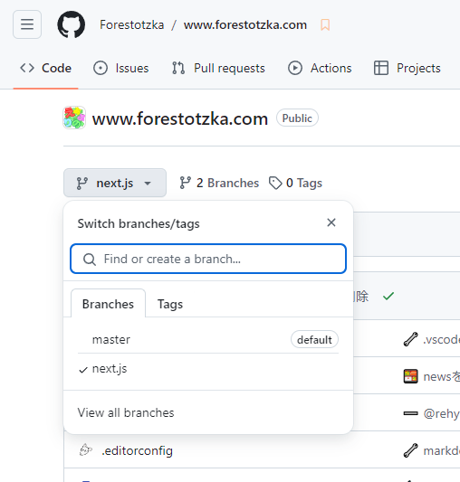

# 1. 前提

## Visual Studio Codeのインストール

記事の執筆にはテキストエディタが必要です。おすすめは **Visual Studio Code** というテキストエディタです。軽量で多機能なエディタで、記事を書く際に必要なMarkdownの記述のサポートを行ってくれたり、記事のアップロードをする際に必要なGitとの連携を簡単に行えます。[公式サイト](https://code.visualstudio.com/)からインストールしてください。

## GitHubへの登録

記事を管理するためには **GitHubアカウント** が必要です。GitHubは、後述するGitの仕組みを利用したウェブ上のバージョン管理サービスです。アカウントは無料で登録できるので、[公式サイト](https://github.co.jp/)から登録してください。

## Gitのインストール

記事のバージョン管理を行うため **Git** のインストールが必要です。Gitはソースコードなどのバージョン履歴を管理するツールで、今回は記事のバージョン履歴の管理に使います。[公式サイト](https://gitforwindows.org/)からインストールしてください。

Gitのインストールはオプションが多いため、以下の記事を参考にインストールしてください。

-   [WindowsにGitをインストールする手順(2024年10月更新)](https://www.curict.com/item/60/60bfe0e.html)
-   [Gitのインストール方法(Windows版)](https://qiita.com/T-H9703EnAc/items/4fbe6593d42f9a844b1c)

## Gitの設定

Gitのインストールが終わったら、以下のコマンドを実行してGitの設定を完了してください。

```bash title="bash"
git config --global user.name "{GitHubに登録したユーザー名}"
```

```bash title="bash"
git config --global user.email "{メールアドレス}"
```

---

# 1.1. 作業の方法

リポジトリに対して何か変更を行う際は、**必ずブランチを作成**してから作業を始めてください。ブランチを切ることで、作業中の変更が他の人に影響を与えたり、本番環境に誤って反映されてしまうことを防ぐことができます。

## なぜブランチを使うの？

ブランチは、プロジェクトの「分岐点」を作るようなものです。自分の作業を別の場所で行うイメージで、本番環境に直接影響を与えず、安心して作業ができます。例えば、誤ったファイルをアップロードしてしまうと、サイトにすぐ反映されてしまいますが、ブランチで作業している場合は、確認してから本番に反映できるので、問題を未然に防ぐことができます。

## Gitの用語がわからない...

「Gitの用語がわからないから、作業が正しく行えるかわからなくて不安だ...」

と感じる方もいるかもしれません。本記事は同じように内容をなぞるだけで記事が完成できるように構成されていますが、それでも心配なときは気軽にらるに聞いてみてください。

---

# 2. 記事の執筆環境の作成

## リポジトリのクローン

まず、リポジトリをローカル環境にクローンします。クローンすることで、記事の作成に必要なファイルにアクセスできるようになります。

1. 任意のディレクトリでターミナルを開きます。
2. 以下のコマンドを実行し、リポジトリをそのディレクトリ直下にクローンします。

```bash title="bash"
git clone https://github.com/Forestotzka/www.forestotzka.com.git
```

3. クローンが完了したら、ローカル環境にリポジトリのコピーが作成されます。Visual Studio Codeで、作成されたリポジトリのコピーを開きましょう。

## ブランチの作成

今からリポジトリに対して変更を加えていきます。そのため、作業を行う前にブランチを作成する必要があります。

1. Visual Studio Codeの左下に `master` と書かれているボタン（ブランチ管理ボタン）があるので、そこを押します。
2. 「Create new branch from...」を押します。
3. 「master」を選択します。
4. 「profiles/{自分の名前}」 を新しいブランチ名として入力します。半角英数字で、単語間はハイフンで繋がれた文字列が好ましいです。(例: `profiles/rarula` )

ブランチが作成できると、Visual Studio Codeの左下に `master` と書かれていたボタンの表示が、新しいブランチ名になっています。

## プロフィールの作成

エアリプの森メンバーとしてのプロフィールを作成する必要があります。ここで作成したプロフィールは、プロフィールページや、作成に関わったブログ記事のトップなどに表示されます。

1. Visual Studio Codeで開いたリポジトリのコピーのroot直下にあるpublicフォルダを開きます。
2. その中のstaffフォルダを開きます。
3. 開いたフォルダ内に、自分のことを示す任意の名前でフォルダを作ります。半角英数字が好ましいです。
4. 作成したフォルダ内に、自分のことを表すアイコン画像を1:1のサイズで icon.png として保存します。拡張子はpngのみがサポートされています。
5. また、以下の内容で metadata.json を作成します。

```json title="metadata.json"
{
    "name": "YOUR_DISPLAY_NAME",
    "description": "DESCRIPTION_OF_YOU",
    "introduction": "SELF_INTRODUCTION",
    "link": {
        "youtube": "YOUTUBE_LINK",
        "twitter": "TWITTER_LINK",
        "reddit": "REDDIT_LINK",
        "homepage": "HOMEPAGE_LINK",
        "others": ["OTHER_PLATFORM_LINK_1", "OTHER_PLATFORM_LINK_2"]
    }
}
```

### "name"

このサイトにおけるあなたの表示名を記入してください。平仮名・漢字なども入力可能です。

### "description"

あなたの表示名と共に表示される短い説明文を記入してください。

### "introduction"

あなたのプロフィールページで表示される自己紹介文を記入してください。

### "link"

あなたのプロフィールページで表示される、各プラットフォームのプロフィールURLを記入してください。 `"others"` は配列で指定することに注意してください。

また、記載する必要のないリンクはセクションごと削除してください。例えば、YouTubeとTwitter以外のリンクが必要ない場合は以下のようになります。

```json
{
    "name": "YOUR_DISPLAY_NAME",
    "description": "DESCRIPTION_OF_YOU",
    "introduction": "SELF_INTRODUCTION",
    "link": {
        "youtube": "YOUTUBE_LINK",
        "twitter": "TWITTER_LINK"
    }
}
```

すべてのリンクが必要ない場合は、以下のようになります。

```json
{
    "name": "YOUR_DISPLAY_NAME",
    "description": "DESCRIPTION_OF_YOU",
    "introduction": "SELF_INTRODUCTION"
}
```

6. 以下の画像のようになっていれば、プロフィールの作成は完了です。


## プロフィールのアップロード

プロフィールが作成出来たら、Gitを使ってプロフィールをアップロードしましょう。今回はVisual Studio Codeを使用していることを想定した手順で説明します。

1. Visual Studio Codeの画面左のタブから、「Source Control」と書かれたグラフアイコンをクリックし、ソース管理パネルを開きます。
2. 追加・変更されたファイルの一覧が表示されているので、作成したプロフィールに関連するフォルダやファイル**すべて**に対して「Stage Changes」を行います。今回だと icon.png と metadata.json ですね。画像のように親フォルダに対して「Stage Changes」して、一括で行ってもよいです。


3. 「Commit」ボタンの上のメッセージ記入欄に任意のメッセージを記入します。（例：「プロフィールを作成」）
4. 「Commit」ボタンを押します。
5. 右上の「…」から「Pull, Push」パネルを開き「Sync」ボタンを押します。

## 確認

実際にサイト上で正しくプロフィールが表示されていることを確認します。

1. [GitHubのリポジトリ](https://github.com/Forestotzka/www.forestotzka.com)にアクセスし、作業したブランチに移動します。



2. 画像のところに先ほど記入したメッセージが表示されます。その横にある「✅」ボタンを押します。


3. 「Details」を押します。


4. 「Branch Preview URL」をクリックし、プレビュー用のサイトに移動します。URLはブランチ名ごとに異なります。


5. 画面上のナビゲーションバーから「PROFILES」をクリックします。
6. 作成したプロフィールのページがあることを確認します。

### メッセージの横に ✅ ボタンが出ない場合

黄色で「●」ボタンが出る場合は、Webサイトのプレビューがまだ構築中であることを意味しています。待ちましょう。

赤色で「×」ボタンが出る場合は、何か作成するべきファイルが不足していたり、ファイル内の記述が間違っている場合があります。フォルダ構造やファイル名など、もう一度見直してみてください。

## マージ

サイト上で正しくプロフィールが表示されていることが確認出来たら、本番環境に今回の変更をマージします。

1. Visual Studio Codeの左下にあるブランチ管理ボタンを押します。
2. 「master」を押して、ブランチをmasterに切り替えます。
3. Visual Studio Codeの画面左のタブから、「Source Control」と書かれたグラフアイコンをクリックし、ソース管理パネルを開きます。
4. 右上の「…」から「Branch」パネルを開き「Merge...」ボタンを押します。
5. 作業したブランチ名を選択することで、ブランチをmasterブランチにマージします。
6. 右上の「…」から「Pull, Push」パネルを開き「Sync」ボタンを押します。

これで、本番環境のWebサイトに先ほど作ったプロフィールの情報がマージされました。

## ブランチの削除

本番環境で正しくプロフィールが表示されていることが確認出来たら、作成したブランチを削除します。今回作成したブランチでの作業は先ほど本番環境のブランチにマージしたので、もう消しても問題ありません。

まず、以下のコマンドを実行するか、Visual Studio Codeのブランチ管理ボタンからmasterブランチに切り替えてください。

```bash title="bash"
git checkout master
```

そして、以下の2つのコマンドを実行し、ブランチを削除します。`[branch-name]` には作成したブランチの名前を入力してください。

```bash title="bash"
git branch -d [branch-name]
git push --delete origin [branch-name]
```

これで、プロフィールを作成したブランチが削除されました。

記事の執筆環境が出来たので、ここからは実際にニュースやブログといった記事の作り方について説明していきます。

---

# 3a. ニュースの作成

## ブランチの作成

作業を行う前にブランチを作成する必要があります。

1. Visual Studio Codeの左下にあるブランチ管理ボタンを押します。
2. 「Create new branch from...」を押します。
3. 「master」を選択します。
4. 「news/{ニュースの概要}」 を新しいブランチ名として入力します。半角英数字で、単語間はハイフンで繋がれた文字列が好ましいです。(例: `news/published-the-forestotzka-website` )

ブランチが作成できると、Visual Studio Codeの左下に書かれていたボタンの表示が、新しいブランチ名になっています。

## ニュースを作成するディレクトリに移動

1. Visual Studio Codeで開いたリポジトリのコピーのroot直下にあるpublicフォルダを開きます。
2. その中のresourcesフォルダを開きます。
3. その中のnewsフォルダを開きます。
4. 開いたフォルダ内に、ニュースの概要を示す任意の名前でフォルダを作ります。（半角英数字で、単語間はハイフンで繋がれた文字列が好ましいです。）
5. 作成したフォルダを開きます。

## ニュースに必要なファイルを作成

ニュースを作るには以下のファイルが必要になります。これらのファイルを先ほど開いたフォルダ内に作成します。

-   content.md - ニュースの内容。Markdownで記述する必要がある。
-   image.png - ニュースのサムネイル画像。16:9のサイズである必要があり、拡張子はpngのみがサポートされている。
-   metadata.json - ニュースのメタデータ（タイトル、投稿日など）を記述するJSONファイル。

## Markdownを書く

記事におけるMarkdownの記法は多岐にわたるため、[記事のMarkdown記法一覧](/blogs/markdown-post-syntax-list)というブログにその一覧をまとめました。記事を書く際はご一読ください。

## メタデータを編集

以下の内容を metadata.json ファイルに貼り付け、ニュースの内容に沿うように編集してください。

```json title="metadata.json"
{
    "title": "YOUR_NEWS_TITLE",
    "description": "YOUR_NEWS_DESCRIPTION",
    "post_date": "2024-10-07",
    "last_update_date": "2024-10-07"
}
```

### "title"

ニュースのタイトル。ニュース一覧やシェアされた時の埋め込みで大きく表示されるテキストです。

### "description"

ニュースの説明文。シェアされた時の埋め込みで表示されるテキストです。

### "post_date"

ニュースの投稿日。 `YYYY-MM-DD` の形式で記入される必要があります。

### "last_update_date"

ニュースの最終更新日。 `YYYY-MM-DD` の形式で記入される必要があります。

---

# 3b. ブログの作成

## ブランチの作成

作業を行う前にブランチを作成する必要があります。

1. Visual Studio Codeの左下にあるブランチ管理ボタンを押します。
2. 「Create new branch from...」を押します。
3. 「master」を選択します。
4. 「blogs/{ブログの概要}」 を新しいブランチ名として入力します。半角英数字で、単語間はハイフンで繋がれた文字列が好ましいです。(例: `blogs/how-to-create-news-and-blogs`, `blogs/markdown-post-syntax-list` )

ブランチが作成できると、Visual Studio Codeの左下に書かれていたボタンの表示が、新しいブランチ名になっています。

## ブログを作成するディレクトリに移動

1. Visual Studio Codeで開いたリポジトリのコピーのroot直下にあるpublicフォルダを開きます。
2. その中のresourcesフォルダを開きます。
3. その中のblogsフォルダを開きます。
4. 開いたフォルダ内に、ブログの概要を示す任意の名前でフォルダを作ります。（半角英数字で、単語間はハイフンで繋がれた文字列が好ましいです。）
5. 作成したフォルダを開きます。

## ブログに必要なファイルを作成

ブログを作るには以下のファイルが必要になります。これらのファイルを先ほど開いたフォルダ内に作成します。

-   content.md - ブログの内容。Markdownで記述する必要がある。
-   image.png - ブログのサムネイル画像。16:9のサイズである必要があり、拡張子はpngのみがサポートされている。
-   metadata.json - ブログのメタデータ（タイトル、投稿日など）を記述するJSONファイル。

## Markdownを書く

記事におけるMarkdownの記法は多岐にわたるため、[記事のMarkdown記法一覧](/blogs/markdown-post-syntax-list)というブログにその一覧をまとめました。記事を書く際はご一読ください。

## メタデータを編集

以下の内容を metadata.json ファイルに貼り付け、ブログの内容に沿うように編集してください。

```json title="metadata.json"
{
    "title": "YOUR_NEWS_TITLE",
    "description": "YOUR_NEWS_DESCRIPTION",
    "staff": [],
    "tags": [],
    "post_date": "2024-10-07",
    "last_update_date": "2024-10-07"
}
```

### "title"

ブログのタイトル。ブログ一覧やシェアされた時の埋め込みで大きく表示されるテキストです。

### "description"

ブログの説明文。シェアされた時の埋め込みで表示されるテキストです。

### "staff"

ブログに関わった人達を示す欄。ここで指定された人は、ブログ一覧やブログトップで関係者としてプロフィールが表示されます。記入する名前は、その人の表示名ではなく、`./public/staff` ディレクトリ直下のフォルダ名を指定します。配列で指定することに注意してください。

以下は記入例です。

```json caption="rarulaさんが関わった記事として指定する場合。表示名は ./public/staff/rarula/metadata.json から取得される。"
{
    "staff": ["rarula"]
}
```

### "tags"

ブログに関連するタグを示す欄。ここで指定されたタグは、ブログトップで関連するタグとしてハッシュタグの形式で表示されます。タグは平仮名・漢字による記述も可能です。配列で指定することに注意してください。

以下は記入例です。

```json caption="本・読書が関連する記事として指定する場合"
{
    "tags": ["本", "読書"]
}
```

### "post_date"

ブログの投稿日。 `YYYY-MM-DD` の形式で記入される必要があります。

### "last_update_date"

ブログの最終更新日。 `YYYY-MM-DD` の形式で記入される必要があります。

---

# 記事のアップロード

記事が執筆できたら、Gitを使って記事をアップロードしましょう。今回はVisual Studio Codeを使用していることを想定した手順で説明します。

1. Visual Studio Codeの画面左のタブから、「Source Control」と書かれたアイコンをクリックし、ソース管理パネルを開きます。
2. 追加・変更が加えられたファイルの一覧が表示されているので、作成した記事に関連するフォルダやファイル**すべて**に対して「Stage Changes」を行います。
3. 「Commit」ボタンの上のメッセージ記入欄に任意のメッセージを記入します。（例：「○○ニュースを作成」「○○ブログを更新」）
4. 「Commit」ボタンを押します。
5. 右上の「…」から「Pull, Push」パネルを開き「Sync」ボタンを押します。

## 確認

実際にサイト上で正しく記事が表示されていることを確認します。

1. [GitHubのリポジトリ](https://github.com/Forestotzka/www.forestotzka.com)にアクセスし、作業したブランチに移動します。
2. コミットメッセージの横にある「✅」ボタンを押します。
3. 「Details」を押します。
4. 「Branch Preview URL」をクリックし、プレビュー用のサイトに移動します。URLはブランチ名ごとに異なります。
5. 画面上のナビゲーションバーから「NEWS」または「BLOGS」をクリックします。
6. 作成した記事のページが正しく表示されていることを確認します。

## マージ

サイト上で正しく記事が表示されていることが確認出来たら、本番環境に今回の変更をマージします。

1. Visual Studio Codeの左下にあるブランチ管理ボタンを押します。
2. 「master」を押して、ブランチをmasterに切り替えます。
3. Visual Studio Codeの画面左のタブから、「Source Control」と書かれたグラフアイコンをクリックし、ソース管理パネルを開きます。
4. 右上の「…」から「Branch」パネルを開き「Merge...」ボタンを押します。
5. 作業したブランチ名を選択することで、ブランチをmasterブランチにマージします。
6. 右上の「…」から「Pull, Push」パネルを開き「Sync」ボタンを押します。

本番環境のWebサイトに先ほど作った記事の情報がマージされました。

## ブランチの削除

本番環境で正しく記事が表示されていることが確認出来たら、作成したブランチを削除します。今回作成したブランチでの作業は先ほど本番環境のブランチにマージしたので、もう消しても問題ありません。

まず、以下のコマンドを実行するか、Visual Studio Codeのブランチ管理ボタンからmasterブランチに切り替えてください。

```bash title="bash"
git checkout master
```

そして、以下の2つのコマンドを実行し、ブランチを削除します。`[branch-name]` には作成したブランチの名前を入力してください。

```bash title="bash"
git branch -d [branch-name]
git push --delete origin [branch-name]
```

これで、記事を作成したブランチが削除されました。

これにて記事のアップロードは完了です。お疲れさまでした。
