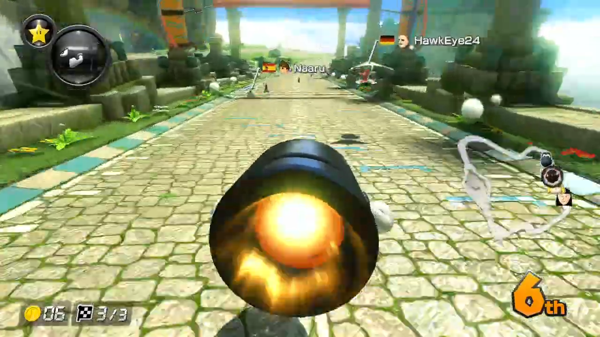
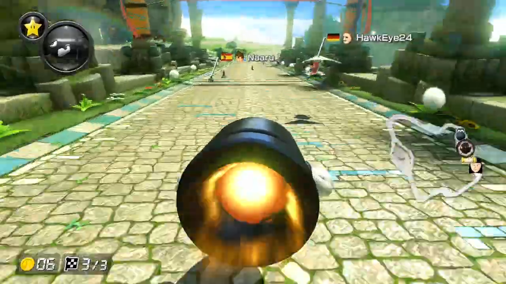
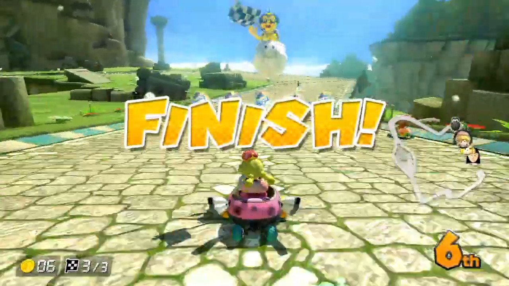
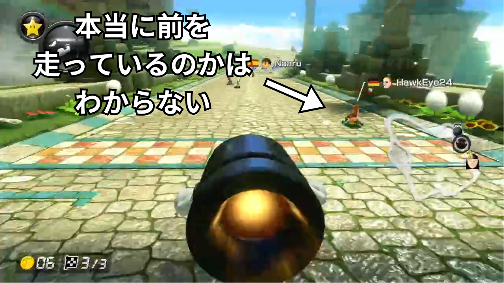

# 順位表示が消える！？！？

「マリオカート８デラックス」でレースを楽しんでいたとき、ゴールする直前、順位表示が消えたことに気が付きました。

順位が表示されているが...  

少し進むと表示が消えてしまった。これでは順位がわからない。  

ゴールすると、また順位が表示された。  

このを見ると、ゴールの直前にのみ順位表示が消えることがわかります。これは一体なぜなのでしょうか？  

# そのほうがハラハラするから？

「そのほうがハラハラするから」という理由を考えてみましょう。  
実際、「おっ、おっ、おっ、これは何位だ～～～～～～～～～？...(順位が表示される)１位だ！！！やった～～！！！！！！！！！」となれば嬉しいものです。  
  
しかし、実はそれは順位が消える理由ではありません。  
  
なぜなら、グランプリなど、**オフラインでCPUと対戦するモードでは順位は消えない** からです。  
  
# では本当の理由は...？

「オンライン対戦」と「オフライン対戦」の違い...それは「ラグ」です。  
  
オンライン対戦にはつきものなラグ。これが、ゴール直前で順位表示が消える本当の理由です。

# 画面に表示される相手プレイヤーの位置は正確ではない

「ラグ」とは、インターネット上で通信する際の通信遅延のことです。  
例えば、通信が日本からアメリカまでを往復する場合、150ms~200msの通信遅延がかかってしまいます。  

オンライン対戦ゲームでは、この通信遅延が大きいと、プレイに支障が出てしまいます。  
通信遅延があると、レースゲームで実際は相手プレイヤーは真横を走っているのに、自分の画面でははるか後方を走っているように見えてしまう、なんてことが起こってしまうのです。  
「赤こうら」や「トゲゾーこうら」があるマリオカートではプレイヤーの前後関係が重要ですから、位置のズレは大きな問題になってしまいます。

### 常に対戦相手の動きを予測している
  
そこで、これらのオンライン対戦ゲームでは、通信遅延に基づいて常に **対戦相手の動きを予測** しています。  
例えば、２プレイヤー間に100msの通信遅延があった場合、現在のカートの速度などから100ms後の位置を予測し、そこに相手プレイヤーを表示させます。詳しくは別の記事で紹介する予定ですのでそちらもお楽しみに！  
  
当然、予測は必ずしも当たるとは限りません。特に、通信状況が不安定になったときなどに、これらの予測は大きく外れてしまいます。  
  
つまり、**自分から見える相手プレイヤーが、実際にその位置にいるとは限らない** のです。

# 順位表示を消さなければいけない理由

おわかりいただけた方も多いかもしれません。  
自分の画面に表示される対戦相手の位置が実際とは異なる可能性がある以上、すぐには順位を確定させることができないのです。  
  

  
  
相手プレイヤーが、自分とほぼ同じタイミングでゴールしたとします。自分の画面では自分が先にゴールしたように見えても、実際には相手が先にゴールしているかもしれません。  
  
そこで、順位を確定させるために、**二人のうちどちらが先にゴールしたのかをお互いに確認する必要があります**。  
確認が終わってやっと、順位が確定し、画面に順位を表示できます。  

確定しないうちに順位を表示したら、プレイヤーをがっかりさせてしまうかもしれません。「１位でゴールしたと思ったらなぜか２位になってしまった...」というように。  
  
（余談ですが、バグだらけなことで一時期有名になった「チョコボGP」というレースゲームでは、ゴールした後に表示された順位が変動することがあり、批判の対象になりました。）  

# まとめ
このような理由で、マリオカートではゴール直前に順位表示が一時的に消えるようになっています。ゲームプログラミングについての理解が深まったでしょうか？お役に立てれば幸いです。
    
このサイトでは、他にもゲームに関する技術関係の記事を投稿しています。よろしければそちらもぜひご覧ください！