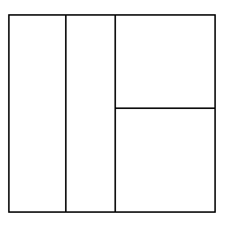
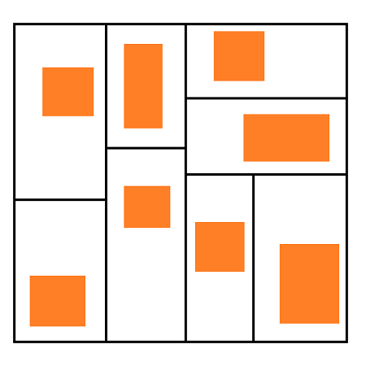
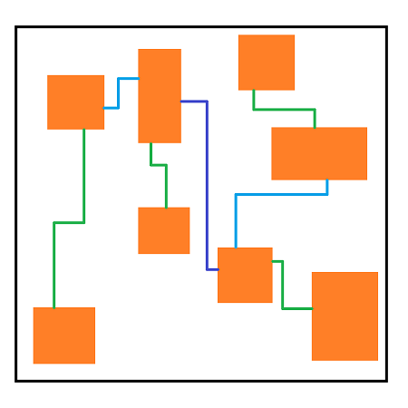
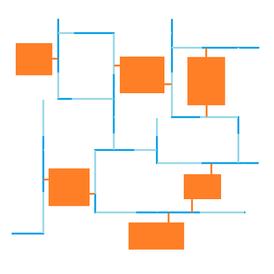

# はじめに

あなたは、ダンジョン探索型のRPGを遊んだことがありますか？

ダンジョン探索型のRPGとして有名なタイトルだと、不思議のダンジョンシリーズとしてリリースされている『風来のシレン』や『ポケモン不思議のダンジョン』などがあります。

これらのゲームは「ローグライク」というゲームジャンルに属しており、世界的に大きな人気を得ているゲームジャンルの一つとなっています。

ローグライクと呼ばれるゲームジャンルには、他にはない一つの大きな特徴として **あらかじめ決められた形のダンジョンが存在せず、プレイする度に異なる構造のダンジョンが舞台となる** という特徴があります。

この記事では、ローグライクのダンジョンがプレイする度に変化していく仕組みについて解説します。また、私が独自に考案したダンジョン生成アルゴリズムを用いて、ローグライク風のダンジョンをMinecraft上で生成した結果についても紹介したいと思います。

# ローグライクとは

「ローグライク」とは、1980年に誕生したゲーム「Rogue」に由来するゲームジャンルの名前です。

このゲームジャンルの特徴は、プレイする度に異なる構造のダンジョンが舞台となり、探索や攻略が何度遊んでも新鮮であり続けることです。

そんな独特のゲーム体験を生み出すのが「ダンジョン生成アルゴリズム」です。はじめは、アルゴリズムを用いたダンジョン生成の仕組みを解説していきます。

# ダンジョンが変化する仕組みとは

ローグライクゲームでダンジョンがプレイする度に異なる構造になる理由は、ゲームを開始する度に、ゲーム内のプログラムが「アルゴリズム」と呼ばれる設計図を使ってランダムな構造のダンジョンを新しく作り出しているからです。このアルゴリズムによってダンジョンの部屋や通路の配置が決まるため、プレイする度に新しい体験が生まれます。

特に有名なダンジョン生成アルゴリズムの一つとして「Basic BSP Dungeon generation」と呼ばれるものがあります。ここではこのアルゴリズムを一例として、どのように部屋や通路の配置が決められているのかを説明していきます。

## 1. ダンジョン全体の大きさを決める

そのままです。ダンジョンの横幅と縦幅を決めて、ダンジョン全体の大きさを決めます。

## 2. 空間を2つに分割する

空間の中の好きな位置で縦向きもしくは横向きに線をいれることで、その空間を2つに分割します。今回は中央あたりで縦向きに線をいれて分割してみます。

## 3. 好きなだけ分割を繰り返す

先ほど行ったのと同じ方法で分割を好きなだけ繰り返します。今回はあと2回繰り返すことにしましょう。

## 4. ランダムな位置にランダムな大きさの部屋を置く

分割することで生まれたすべての空間の中に、ランダムな大きさの部屋を、適当な位置に配置していきます。今回は空間の2分割を3回繰り返したため、8個の部屋が配置されることになります。

## 5. 2つの空間の部屋どうしを通路で繋ぐ

初めに空間を分割していった順とは逆順に、同じ空間をもとに分割された2つの空間の部屋どうしを通路で繋ぎます。

## 6. 分割した回数だけ繰り返す

分割を繰り返した回数だけ部屋どうしを通路で繋ぎます。今回はあと2回、部屋どうしを通路で繋いでいきます。

## 7. 完成！

空間の分割に用いた線は不要になったので消しておきます。すると、部屋と通路で構成されたダンジョンが生成できたことがわかりますね。この一連の手順がBasic BSP Dungeon generationです。

今回はBasic BSP Dungeon generationというアルゴリズムを一例に説明しましたが、ダンジョンを生成するためのアルゴリズムというのはこれだけではありません。

マップの分割を繰り返して区域を構築していく **区域分割法** というアルゴリズムや、迷路生成アルゴリズムとして有名な **穴掘り法** など、他にも様々なアルゴリズムを活用することができます。

# 独自のアルゴリズムを考えるに至った経緯

先ほど説明したBasic BSP Dungeon generationというアルゴリズムですが、優れた点が存在する一方で、課題となる点も存在します。

まずは、優れた点として **到達不可能な部屋や通路が生まれることがない** という特徴が挙げられます。

「到達不可能な部屋や通路が生まれることがない」というのは、言い換えると「生成されたダンジョンは余すところなく探索できる」ということです。つまり、生成の過程でダンジョンにとって無駄な部分が生まれることがないことを意味しています。

対して、課題となる点としては以下のようなものが挙げられます。

-   通路が一本道で分岐がないため、探索の楽しさが少ない
-   ダンジョン内で道が循環しないため、全体的に単調に感じやすい

「通路が一本道で分岐がない」というのは、完成したダンジョンの図を見てみるとすぐに分かります。

どの道を見ても、曲がり角はあれど、道が分岐している地点はひとつもありません。これはアルゴリズム上、通路が「2つの部屋どうしを繋ぐため」だけの目的で生成されることからなる問題です。

「ダンジョン内で道が循環しない」というのも、このダンジョンの図を観察してみるとよく分かります。

「ある部屋からある部屋に行くための道がひとつしかない」という構造になっており、「移動し続けると元の部屋に戻ってくる」というような循環が起こりえないダンジョンになっています。これもアルゴリズム上、必要最低限の数の通路しか生成されないことからなる問題です。

これらの課題を克服し、より探索の楽しさや緊張感を感じられるダンジョンの生成を実現するため、私は独自のダンジョン生成アルゴリズムを考えることにしました。

# アルゴリズムの設計思想

探索していて面白いダンジョンとしての目標は、プレイヤーに「未知の空間を攻略している感覚」を与えることだと考えました。そこで、以下の3つの要素が重要であると判断しました。

1. **通路に分岐があること**

    プレイヤーが自らの意思で進むべき道を選択できることで、探索に戦略性をもたらし、飽きにくいゲーム体験を提供します。

2. **道が循環すること**

    ループ状の構造があれば、プレイヤーが同じ場所を複数回通る可能性が生まれるため、「あそこはまだ調べていないかも」といった発見の感覚を促すことに繋がります。

3. **通路主体の構造**

    上記の2つの要素は、どちらも通路で発生する楽しさを引き起こすための要素です。これらがもたらす楽しさをより助長するため、部屋を主体とした設計ではなく、通路を主体とした設計が適していると考えました。

生成するダンジョンにこれらの要素を反映させるため、私は次のような独自の手法を取り入れることにしました。

# アルゴリズムの手順

## 1. ダンジョン全体の大きさを決める

Basic BSP Dungeon generationの時と同じく、はじめにダンジョンの横幅と縦幅を決めて、ダンジョン全体の大きさを決めます。

## 2. 空間をタイル状に分割する

空間全体をタイル状になるように分割します。今回は横に4つ、縦に4つの空間が生まれるように分割したので、計16個の空間が生まれました。

## 3. 空間に通路を配置する

すべての空間に横向き・縦向きの通路を交互に配置します。通路の上下方向の位置や左右方向の位置は適当で構いません。

## 4. 通路を延長する

先ほど配置した通路の向きに従って、隣の空間の通路に衝突するまで通路を延長します。

図が見にくくなってきたので、タイル状に分割した際に引いた線を消しておきます。

## 5. 空間に部屋を配置する

ここで、通路やダンジョンの壁に囲まれた新しい空間が生まれているのが分かります。この空間の中に横向き・縦向きの部屋をいくつか配置します。今回は横向きの部屋が3つ、縦向きの部屋が3つで、計6つの部屋を配置しました。

## 6. 両脇の通路を削除する

部屋の出入り口に対して両脇にある通路を削除します。これによって、ダンジョン全体における移動の自由度はそのままに、不要な通路の数を減らすことができます。

## 7. 完成！

最後に、ダンジョン全体の大きさを示す線を消しておきます。すると、部屋と通路で構成されたダンジョンが生成できたことがわかりますね。この一連の手順が、私の考案した独自のアルゴリズムになります。

# このアルゴリズムの特徴について

このアルゴリズムによって生成されたダンジョンについて、私は以下のような特徴を持っていると考えています。

-   **楽しい体験を引き起こしやすい通路の構造**

    通路に分岐があり、さらにそれらが循環する構造を持つため、探索中のプレイヤーに対して行動の選択肢をいくつか与えることができます。

-   **完全な探索可能性がある**

    すべての部屋や通路が確実に繋がるように設計されているため、到達不可能な地点が生まれることがありません。

# Minecraft上で生成してみた

このアルゴリズムをMinecraft内で動作する言語 **mcfunction** を使って実装して、Minecraft上でこのダンジョンを生成できるようにしてみました。今回のダンジョンを3D空間で探索してみたら、いったいどんなゲーム体験になるでしょうか。

この画像は生成されたダンジョンを真上から見た図です。

灰色の立体物が生成されたダンジョンで、その下に見えるタイル状のオブジェクトは、生成過程でダンジョン全体をタイル状に分割した際の空間を視覚化したものになっています。

ダンジョンの中はこんな感じになっています。今回はアルゴリズムをそのまま実装しただけなので、実は生成時点では明かりになるオブジェクトが全くありません。そのため、探索の過程で明かりになる松明を設置しています。

左奥に見える空間は周りと少し雰囲気が違っていますが、それは部屋として生成された空間だからです。地面の色が異なっていたり、テーブルが設置されていたりするのがわかりますね。

松明で周囲を明るくしながら進んでいるのですが、明るくなった時に通路が分岐するのが見えるととてもワクワクします。そのまま前に進むのか、それとも右に曲がって進むのか、どちらの方が探索し甲斐があるかと思うと楽しいですね。

先ほど発見した分岐地点の先を見てみると、部屋がありました。

余談ですが、Minecraft上でこのアルゴリズムを実装するにあたって、部屋に関わる処理だけ少し考えなおしました。というのも、本来は四角形の適当な大きさの部屋を配置するという手順なのですが、それだと部屋の形状に四角形以外のパターンを用意することが難しいことに気付いたためです。

そのため、実はこのダンジョンにおける部屋は、 **あらかじめ決められた形の部屋の群の中から抽選されたもの** をそこに生成するという仕組みになっています。部屋のプリセットがあらかじめ用意されているということですね。

部屋を抜けた先から適当に進んでいると、私が設置した松明の明かりが遠くに見えてきました。狙い通り、ダンジョン内で道が循環するようになっていることも確認できますね。

# おわりに

この記事では、ローグライクのダンジョンがプレイする度に変化していく仕組みについてざっくりと解説しました。

次の記事では、このアルゴリズムをMinecraft上でどのように実現したのか、具体的な実装の解説とともにご紹介します。興味のある方はぜひそちらの記事もご覧ください。
