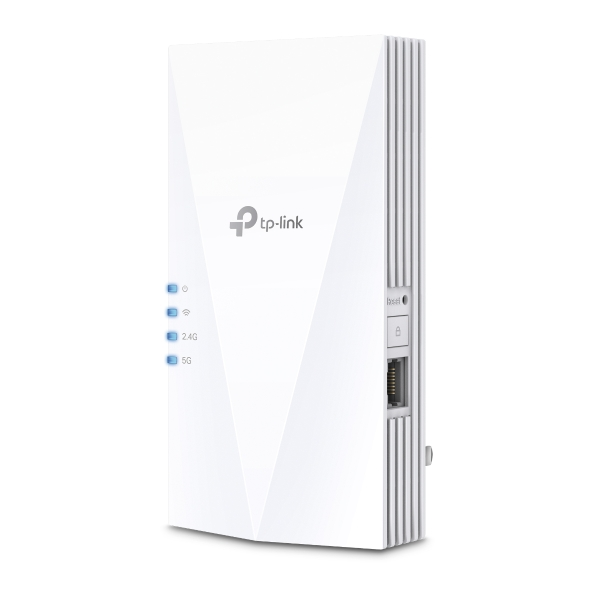
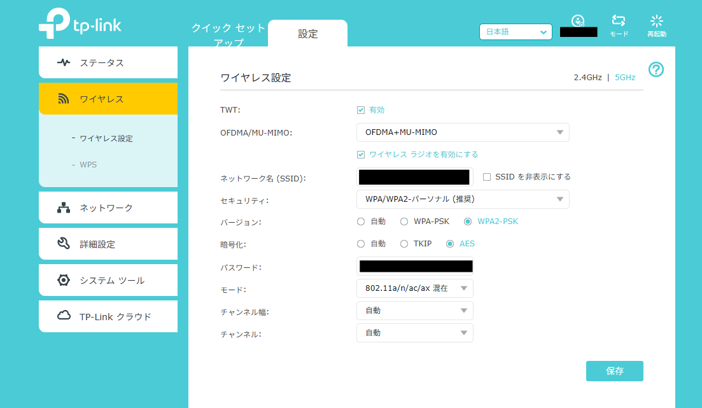

## いきさつ
契約していたISPから借りていたWiFiルーターが古くなったのか、たま～に接続が不安定になるようになった。そこで新しいアクセスポイント(AP)を購入することにした。  
実はルーターとしてはもう使っておらず、単なるAPとして使っている。代わりに、別途購入した高性能ルーターを使っている。しかし、それにはAP機能がないため、APを購入した次第。

## 購入した製品
TP-Linkの [RE600X](https://www.tp-link.com/jp/home-networking/range-extender/re600x/) を購入した。  
価格コムで調べたところ、Amazonで5000円程度で購入できることがわかった。  
WiFi 6(IEEE 802.11ax)に対応しており、将来的にも安心できる。  
同シリーズの製品としては、RE500XやRE700Xがあるが、RE600Xが中間の性能であり、コストパフォーマンスが良さそうだったので、これに決定。

## Wifi 6について
WiFi 6は、IEEE 802.11axとして規格化された無線LANの新しい規格である。  
従来のWiFi 5(IEEE 802.11ac)に比べて、速度の向上、接続台数の増加、電力効率の改善などが図られている。  
特に、OFDMA(直交周波数分割多元接続)やMU-MIMO(マルチユーザー・マルチインプット・マルチアウトプット)などの技術により、多数のデバイスが同時に接続しても安定した通信が可能となっている。  
後継規格のWiFi 6EやWiFi 7も登場しているが、現時点では対応機器が少ない上に高価であるため、WiFi 6で十分と判断した。

## 設定
設定は簡単だが、AP(ブリッジ)モードとして使うには少し手間がかかる。  
1. まず、RE600Xをルーターに接続し、電源を入れる。  
2. スマホやPCでRE600XのWiFiに接続し、ブラウザでhttp://tplinkrepeater.net にアクセスする。  
3. 初回アクセス時にはパスワードの設定が求められるので、設定する。  
4. 「動作モード」の設定画面で「アクセスポイント(AP)モード」を選択する。  
5. SSIDやパスワードなどのWiFi設定を行う。
6. これでAPモードとして動作するようになる。
  
## 注意点  
この後がややこしく、一度ブリッジモードを設定してしまうと、IPが上位のルーターから取得されるようになるため、再度管理画面にアクセスするには、RE600XのIPアドレスを調べて直接アクセスする必要がある。http://tplinkrepeater.net ではアクセスできなくなる。  
  
IPアドレスは、ルーターの管理画面などで確認できる。  
  
また、デフォルトでは5GHz帯のWiFi 6機能(TWT, OFDMA, MU-MIMO)が無効になっているため、設定を変更する必要がある。

## 使用感
使用感は非常に良好で、以前よりも接続が安定した。  
製品のメーカー公式サイトはこちら: [TP-Link RE600X](https://www.tp-link.com/jp/home-networking/range-extender/re600x/)
