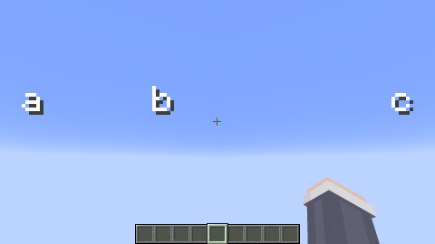

# はじめに

この記事にたどり着いたみなさん、ようこそ。\
さて突然ですが、コマンドで「演出」作ったことありますか？？効果音とかアニメーションとか、今のコマンドでは色々な演出を作れますが、今回はその中でも**画面表示関連**のお話。特に**titleコマンド**を使ったGUIについて色々と書いていこうと思います。\
ちなみに、おそらくこの記事の内容は中～上級者向けだと思います。ただ、titleコマンドの使い方と、リソースパックの作り方が最低限わかっていれば問題ないはずです。

# 何ができるのさ！


まずはあなたの心に住まう「これ作りたい！！！」を刺激するために、実際に作ったものを載せておきます。なんとびっくり、このリザルト画面は全てtitleコマンド（とシェーダーなどなど）で作っています。\
決して必要ではない要素だけど、こういうのがあるとめっちゃワクワクしません？？

さて、今回はこういうのを作っていこう！という記事なんですがその前に...

# え、ディスプレイエンティティでよくね？
最近item_displayやtext_displayのような革命的なヤツらが実装されましたね。~~（2年前、、？）~~\
比較的直感的に操作できるし結構なんでもできるし、titleコマンドよりそっちの方がいいんじゃねーの！と思ったそこのあなた、ちょっと待ってください。

## 1. ディスプレイエンティティは半透明がニガテ
どういうことかは実際に見た方が早いと思います。\
↓↓ということで画像↓↓


手前がtext_display、奥のTNTがblock_displayです。重なってる部分が描画されなくなっちゃう。\
これはバグ報告もされてるみたいなので一応修正待ちではあるんですけど、これは結構きつい。

## 2. 動き回るプレイヤーもニガテ


「ワールド内の特定の場所に表示しておく」という用途ならディスプレイエンティティが最強なんですが、例えばHPバーのように「画面上に表示しておくUI」なんかを作るのは少し苦手です。\
上の動画のように、常時tpコマンドで追従させていても明らかに動いているのがわかってしまいます。F5の視点変更？にもなかなか弱いです。\
そしてこれに関してはおそらく今後改善されることは無いと思います。

## 3. titleは意外となんでもできる
titleコマンドってなかなか癖強いですよね。仕様も割とややこしいし、何種類ものUIを同時に表示したいと思うとかなーりめんどくさい。\
でも！難しそうだしめんどくさいしややこしいtitleコマンドくんですが、色々な「ワザ」を集約すれば意外とどんなUIでも作れるんです！

# titleを万能にするために
というわけで、ここからはその「ワザ」たちを紹介していこうと思います。ただ全部解説してたらとんでもないボリュームになってしまうので、この記事ではそれぞれ触りの部分だけ解説しようと思います。

## 0. 前提知識
画像の表示の仕方とか

## 1. スペース
まずは一度titleコマンドにおける「スペース」の仕様について解説していきます。なんのこっちゃと思うかもしれませんがしばしお付き合いください。

では、titleコマンドを使って「a&nbsp;&nbsp;&nbsp;&nbsp;&nbsp;&nbsp;&nbsp;&nbsp;&nbsp;b」という文字を表示する例を考えてみます。
```mcfunction:test
/title @s title "a         b"
```
実際にこのコマンドを打つとわかると思いますが、表示される文字は以下の画像ように「a b」になるはずです。


これは、「titleコマンドなどのテキストに含まれる**複数個繋がった空白文字**は、<span style="color:#FF3333">**一つの空白**</span>として扱われる」ということが原因です。

さて、これを踏まえた上で本題に戻りましょう。
まず**「titleコマンドでUIはどうやって作っているのか」**ですが、そもそもtitleコマンドで表示できるものは**「たった一つの文字列」**です。「あああ」とか「abcde」とか。

では、例えば画面左と画面右にそれぞれ異なるUIを表示したいとしたらどうすれば良いでしょうか？ここからはそれぞれのUIを「左」「右」という文字で簡略化して考えてみます。

まず思いつくのは「左&nbsp;&nbsp;&nbsp;&nbsp;&nbsp;&nbsp;&nbsp;&nbsp;&nbsp;&nbsp;&nbsp;&nbsp;&nbsp;&nbsp;&nbsp;&nbsp;&nbsp;&nbsp;右」のようにたくさんスペースを開ける方法ですが、このやり方ではさっき説明した通りスペースがまとまって「左 右」のようになってしまいます。
そこで登場するのが、いわゆる**「カスタムスペース」**といった方法です。

まずはリソースパックを作って、その`minecraft\font\`内に、こんな感じのjsonファイルを追加します。ここでは`test.json`という名前にしておきます。
```json
{
    "providers": [
        {
            "type": "space",
            "advances": {
                "あ": 30,
                "い": 60
            }
        },
        {
            "type": "reference",
            "id": "default"
        }
    ]
}
```

リソースパックがきちんと読み込めたら、このコマンドを実行してみましょう。
```mcfunction
/title @s title {"text":"aあbいc","font":"test"}
```
そうすると、こんな感じで表示されるはずです。


ひとまず何をしたのか解説していきます。
まずリソースパックに作ったjsonファイルですが、これの役割は端的に言うと**「翻訳」**です。今作ったjsonには、「testというフォントを適応した時、**『あ』**という文字は**『幅30の空白』**に、**『い』**という文字は**『幅60の空白』**に置き換えてね」ということが書かれています。
`"type":"reference"`と書いてある部分には、「その他の文字は全てデフォルトのフォントを参照してね！」という意味になります。

そしてさっき打ったコマンドは、「testというフォントのルールに則って**aあbいc**という文字列を表示してね。」ということです。

これが「カスタムスペース」なわけですが、ここで一つ疑問が湧いてきたんじゃないでしょうか！

**「これって負の数を入れたらどうなるんだろう？」**

では、やってみましょう。

先程のjsonファイルを少し変えて、
```json
{
    "providers": [
        {
            "type": "space",
            "advances": {
                "あ": 30,
                "い": -50
            }
        },
        {
            "type": "reference",
            "id": "default"
        }
    ]
}
```
こんな感じにしてみました。リソパの再読み込みをして、この状態でさっきと同じコマンドを実行してみると...？？


！！！！！
負の数を入れたら、cがかなり左に移動しましたね。つまり、正のスペースは通常通り<b>右にずらす効果</b>、負のスペースは逆に<b>左にずらす効果</b>があるということです。

これを使えば、例えば下の画像のように<b>背景を表示してからその上に文字を表示する</b>なんてこともできます！（背景、負のスペース、文字の順で表示してるよ）


## 2. シェーダー
さて、カスタムスペースを覚えたことによって左右方向は自由に調節できるようになりましたけど、なら今度は上下も調節したいですよね。というわけで！今度は上下の調節のやり方について書いていきます。


